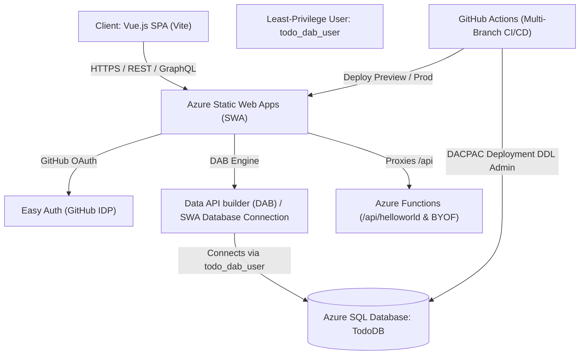

# Implementation Plan: Workshop Learning Outcomes & Deliverables Documentation

## 1. Executive Summary & Objective
This implementation plan defines the complete specification and structural blueprint for generating [`OUTCOMES.md`](file:///home/admin_owaino_altostrat_com/.ai-sdlc/projects/cardiff-serverless-days-workshop/.worktrees/run-2026082514030770/OUTCOMES.md) at the repository root. The document synthesizes the learning outcomes, technical proficiencies gained, architectural patterns, and verifiable deliverables produced throughout the Cardiff Serverless Days Azure Workshop based on [`README.md`](file:///home/admin_owaino_altostrat_com/.ai-sdlc/projects/cardiff-serverless-days-workshop/.worktrees/run-2026082514030770/README.md) and [`adlc/specify.md`](file:///home/admin_owaino_altostrat_com/.ai-sdlc/projects/cardiff-serverless-days-workshop/.worktrees/run-2026082514030770/adlc/specify.md).

---

## 2. Architectural Overview



---

## 3. Resolution of Findings & Key Enhancements

1. **In-Progress Deliverables Specification**:
   - Explicitly detail the database schema evolution in [`database/TodoDB/Tables/dbo.todos.sql`](file:///home/admin_owaino_altostrat_com/.ai-sdlc/projects/cardiff-serverless-days-workshop/.worktrees/run-2026082514030770/database/TodoDB/Tables/dbo.todos.sql) introducing the `[inprogress] BIT NOT NULL` column with the default constraint `ALTER TABLE [dbo].[todos] ADD DEFAULT ((0)) FOR [inprogress]`.
   - Explicitly detail post-deployment seed script updates in [`database/TodoDB/Script.PostDeployment.sql`](file:///home/admin_owaino_altostrat_com/.ai-sdlc/projects/cardiff-serverless-days-workshop/.worktrees/run-2026082514030770/database/TodoDB/Script.PostDeployment.sql) inserting initial values for the `inprogress` column across sample records.
   - Explicitly reference frontend updates in [`client/src/components/ToDoList.vue`](file:///home/admin_owaino_altostrat_com/.ai-sdlc/projects/cardiff-serverless-days-workshop/.worktrees/run-2026082514030770/client/src/components/ToDoList.vue) including toggle controls, status badge styling, and REST `PATCH` invocations against `/data-api/rest/Todo/id/{id}`.
   - Document the lifecycle of Azure SWA isolated pull-request staging preview environments.

2. **Database Least-Privilege & Application User Architecture**:
   - Differentiate between deployment credentials (`AZURE_SQL_CONNECTION_STRING` using SQL Server admin login for DDL operations via SqlAzureDacpacDeployment) and runtime database connection credentials.
   - Document the creation and usage of the least-privilege runtime database user `todo_dab_user` (password `rANd0m_PAzzw0rd!`) configured in [`database/TodoDB/Script.PostDeployment.sql`](file:///home/admin_owaino_altostrat_com/.ai-sdlc/projects/cardiff-serverless-days-workshop/.worktrees/run-2026082514030770/database/TodoDB/Script.PostDeployment.sql) and linked in Azure Static Web Apps Database Connections as specified in [`README.md`](file:///home/admin_owaino_altostrat_com/.ai-sdlc/projects/cardiff-serverless-days-workshop/.worktrees/run-2026082514030770/README.md) Step 6.

3. **CI/CD Multi-Branch & PR Workflow Trigger Mechanics**:
   - Document GitHub Actions workflow triggers adaptation from [`README.md`](file:///home/admin_owaino_altostrat_com/.ai-sdlc/projects/cardiff-serverless-days-workshop/.worktrees/run-2026082514030770/README.md) Step 8, supporting `workflow_dispatch`, `push` triggers on `main` and `inprogress`, and `pull_request` triggers (`[opened, synchronize, reopened, closed]`) across branches.
   - Explain how pull request events trigger automated provisioning and teardown of preview environments with separate database connection requirements.

4. **Explicit Target Document Section Outline**:
   - Define the exact heading hierarchy and section mapping of [`OUTCOMES.md`](file:///home/admin_owaino_altostrat_com/.ai-sdlc/projects/cardiff-serverless-days-workshop/.worktrees/run-2026082514030770/OUTCOMES.md) to ensure 100% adherence to [`adlc/specify.md`](file:///home/admin_owaino_altostrat_com/.ai-sdlc/projects/cardiff-serverless-days-workshop/.worktrees/run-2026082514030770/adlc/specify.md).

---

## 4. Target Document Structure Outline ([`OUTCOMES.md`](file:///home/admin_owaino_altostrat_com/.ai-sdlc/projects/cardiff-serverless-days-workshop/.worktrees/run-2026082514030770/OUTCOMES.md))

```markdown
# Cardiff Serverless Days Workshop: Learning Outcomes & Deliverables

## 1. Executive Summary & Workshop Overview
- Purpose of the workshop
- Target audience & core learning objectives
- High-level architectural narrative

## 2. Architectural Stack & Technology Matrix
- Breakdown table: Layer, Technology, Role / Responsibility
  - Frontend: Vue.js SPA + Vite
  - Hosting & Platform: Azure Static Web Apps (SWA)
  - Data Layer: Azure SQL Database (TodoDB)
  - API Engine: Data API builder (DAB) / SWA Database Connections
  - Identity & Access: Easy Auth (GitHub IDP) & DAB Role Policies
  - Serverless Extensibility: Azure Functions (Managed & BYOF)
  - CI/CD & Automation: GitHub Actions (Multi-Branch & PR Previews)

## 3. Detailed Learning Outcomes by Module
### 3.1 Module 1: Serverless Full-Stack Architecture
- Jamstack principles on Azure
- Eliminating CRUD API boilerplate via Data API builder
### 3.2 Module 2: Cloud Infrastructure & Database Provisioning
- Azure CLI resource group (`cardiff-serverless-days`), SWA, and Azure SQL logical server (`cardiff-serverless-days-db<rng>`) provisioning
- Firewall rules (`AllowAllWindowsAzureIps`) and Entra ID (AD) admin configuration
- Least-privilege application user pattern (`todo_dab_user` vs DDL admin credentials)
### 3.3 Module 3: Automated CI/CD, Multi-Branch & Preview Environments
- GitHub Secrets configuration: `AZURE_CLIENT_ID`, `AZURE_CLIENT_SECRET`, `AZURE_TENANT_ID`, `SUBSCRIPTION_ID`, `AZURE_STATIC_WEB_APPS_API_TOKEN`, `AZURE_SQL_CONNECTION_STRING`
- Service Principal RBAC (`Contributor` role assignment)
- Multi-branch and PR workflow triggers (`push`, `pull_request` on `main` and `inprogress`)
- SWA automated preview staging environments for pull requests
### 3.4 Module 4: Database-as-an-API & Declarative Access Control
- SWA Database Connections configuration (`staticwebapp.database.config.json`)
- Entity definitions, permissions mapping (`anonymous` vs `authenticated`), and field-level security
- Auto-generated REST endpoints (`/data-api/rest/*`) and GraphQL endpoints (`/data-api/graphql`)
### 3.5 Module 5: End-to-End Feature Development & Schema Evolution
- SQL schema migration: adding `[inprogress] BIT NOT NULL` with `DEFAULT ((0))` in `dbo.todos.sql`
- Post-deployment seed script updates in `Script.PostDeployment.sql`
- Frontend UI modifications in `ToDoList.vue` (toggle controls, status filtering, REST PATCH integration)
- DAB handling of non-nullable columns with database default constraints
### 3.6 Module 6: Serverless API Extensibility & Advanced Tracks
- Managed Azure Functions HTTP endpoints (`/api/helloworld`)
- Propagating client authentication context (`userDetails`) to serverless APIs
- Local developer emulation tooling (`@azure/static-web-apps-cli`, Azure Functions Core Tools)
- Standalone Bring-Your-Own-Functions (`BYOF`) architecture

## 4. Concrete Deliverables & Verification Checklist
- Interactive markdown checklist covering:
  - Forked & configured repository with 6 CI/CD secrets
  - Provisioned Azure cloud resources
  - Live deployed Todo web app with GitHub authentication
  - Zero-code REST and GraphQL DAB backend over `dbo.todos`
  - In-progress feature branch with schema extension (`BIT`, `DEFAULT ((0))`), seed scripts, UI updates, and PR preview deployment
  - Managed `/api/helloworld` endpoint & BYOF tracks
```

---

## 5. Detailed Work Breakdown & Implementation Tasks

### Task 1: Document Initialization & Header Matching
- Create [`OUTCOMES.md`](file:///home/admin_owaino_altostrat_com/.ai-sdlc/projects/cardiff-serverless-days-workshop/.worktrees/run-2026082514030770/OUTCOMES.md) in the repository root.
- Ensure top-level header is exactly `# Cardiff Serverless Days Workshop: Learning Outcomes & Deliverables`.

### Task 2: Architectural Stack & Technology Matrix Section
- Populate technology table with exact repository references:
  - [`client/package.json`](file:///home/admin_owaino_altostrat_com/.ai-sdlc/projects/cardiff-serverless-days-workshop/.worktrees/run-2026082514030770/client/package.json) (Vue 3, Vite)
  - [`swa-db-connections/staticwebapp.database.config.json`](file:///home/admin_owaino_altostrat_com/.ai-sdlc/projects/cardiff-serverless-days-workshop/.worktrees/run-2026082514030770/swa-db-connections/staticwebapp.database.config.json) (DAB config)
  - [`database/TodoDB/TodoDB.sqlproj`](file:///home/admin_owaino_altostrat_com/.ai-sdlc/projects/cardiff-serverless-days-workshop/.worktrees/run-2026082514030770/database/TodoDB/TodoDB.sqlproj) (SQL Database Project)
  - `.github/workflows/` (GitHub Actions CI/CD)

### Task 3: Comprehensive Learning Outcomes Breakdown
- Document all 6 modules thoroughly:
  - **Module 1 (Full-Stack Serverless)**: Jamstack model, decoupling presentation from persistence, DAB zero-code API generation.
  - **Module 2 (Infrastructure & Security)**: Azure CLI provisioning commands, SQL firewall rule configuration, Entra ID admin setup, and least-privilege DAB runtime application user (`todo_dab_user` with password `rANd0m_PAzzw0rd!`).
  - **Module 3 (CI/CD & Workflows)**: Explicit documentation of all 6 GitHub secrets (`AZURE_CLIENT_ID`, `AZURE_CLIENT_SECRET`, `AZURE_TENANT_ID`, `SUBSCRIPTION_ID`, `AZURE_STATIC_WEB_APPS_API_TOKEN`, `AZURE_SQL_CONNECTION_STRING`), SP Contributor RBAC, and multi-branch / PR workflow triggers across `main` and `inprogress`.
  - **Module 4 (Data API Builder & Security)**: Declarative entity mapping, role authorization (`anonymous` vs `authenticated`), auto-generated REST (`/data-api/rest/Todo`) and GraphQL endpoints (`/data-api/graphql`).
  - **Module 5 (Schema Evolution & Frontend)**: Detailed SQL DDL schema changes (`[inprogress] [bit] NOT NULL` with `DEFAULT ((0))`), post-deployment seed scripts (`Script.PostDeployment.sql`), and Vue component integration in [`client/src/components/ToDoList.vue`](file:///home/admin_owaino_altostrat_com/.ai-sdlc/projects/cardiff-serverless-days-workshop/.worktrees/run-2026082514030770/client/src/components/ToDoList.vue).
  - **Module 6 (API Extensions & Advanced Tracks)**: Managed `/api/helloworld` Azure Function, user identity header propagation (`clientPrincipal`), local emulation with `swa start`, and Bring-Your-Own-Functions (`BYOF`) architecture.

### Task 4: Concrete Deliverables Checklist
- Detail verification checklist matching [`adlc/specify.md`](file:///home/admin_owaino_altostrat_com/.ai-sdlc/projects/cardiff-serverless-days-workshop/.worktrees/run-2026082514030770/adlc/specify.md) Section 4.3 with full sub-deliverables for the `inprogress` branch, security patterns, and serverless extensions.

---

## 6. Verification & Validation Strategy

1. **Header Compliance Check**:
   - Verify that line 1 of [`OUTCOMES.md`](file:///home/admin_owaino_altostrat_com/.ai-sdlc/projects/cardiff-serverless-days-workshop/.worktrees/run-2026082514030770/OUTCOMES.md) starts with `# Cardiff Serverless Days Workshop: Learning Outcomes & Deliverables`.
2. **Secret Coverage Verification**:
   - Verify that all 6 secrets (`AZURE_CLIENT_ID`, `AZURE_CLIENT_SECRET`, `AZURE_TENANT_ID`, `SUBSCRIPTION_ID`, `AZURE_STATIC_WEB_APPS_API_TOKEN`, `AZURE_SQL_CONNECTION_STRING`) are present and accurately documented.
3. **In-Progress Feature Verification**:
   - Verify presence of `BIT` data type, `DEFAULT ((0))` constraint, [`client/src/components/ToDoList.vue`](file:///home/admin_owaino_altostrat_com/.ai-sdlc/projects/cardiff-serverless-days-workshop/.worktrees/run-2026082514030770/client/src/components/ToDoList.vue), [`database/TodoDB/Script.PostDeployment.sql`](file:///home/admin_owaino_altostrat_com/.ai-sdlc/projects/cardiff-serverless-days-workshop/.worktrees/run-2026082514030770/database/TodoDB/Script.PostDeployment.sql), and isolated PR staging preview environments.
4. **Least-Privilege & Workflow Trigger Verification**:
   - Verify documentation of `todo_dab_user` runtime least-privilege user and GitHub Actions `push` / `pull_request` workflow triggers across `main` and `inprogress`.
5. **Formatting & Links**:
   - Verify valid markdown links, tables, code blocks, and callouts throughout the generated document.
